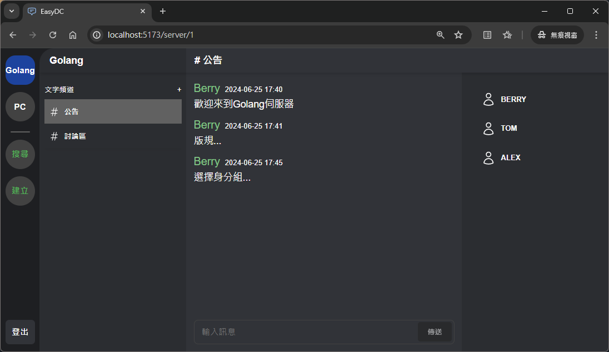
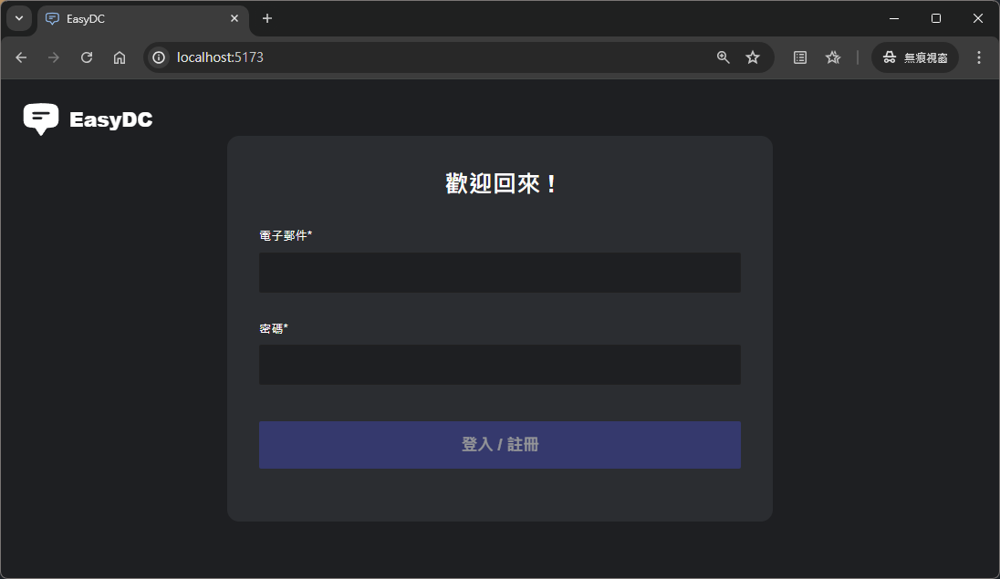
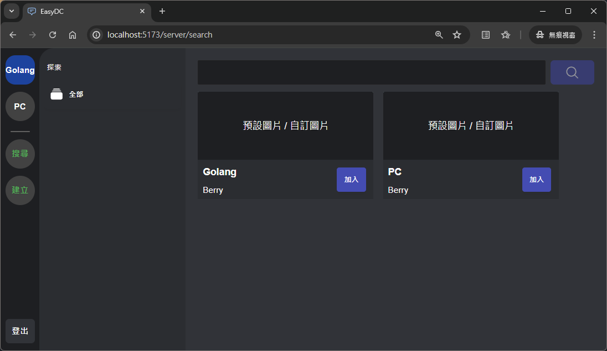
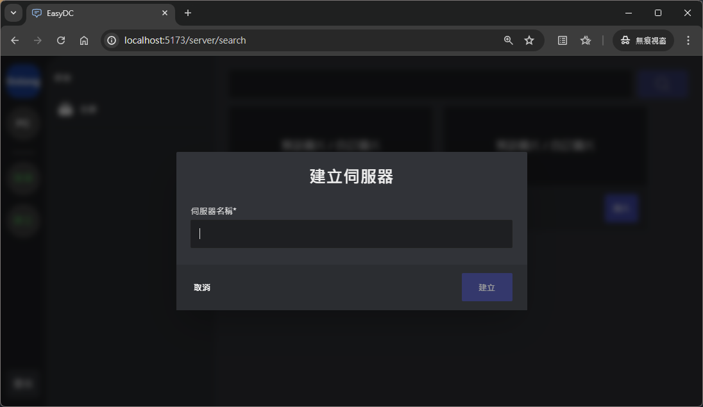

# EasyDC ─ Static Easy Discord Front─end (React Tailwind)

## 簡介

這個專案是模擬 Discord 前端使用畫面，資料來源是[靜態的 JSON 伺服器資料](./static_data/example.json)，為後續連接 Golang 後端所預先建立模板用途，因此在資料的輸出入處已設定成用變數方式傳遞，並且都會有對應的顯示結果，除建立伺服器外未撰寫更新靜態 JSON 案，不過依然可以跳轉至新伺服器 URL，多數的 hadlers 觸發都可以在`console.log`下檢視結果。頁面元件（React components）如下:

    |───EasyDC
    |   |───登入
    |   |───後臺平台（Platform）
    |       |───SideBar
    |       |───新使用者引導（無伺服器）
    |       |───DC伺服器
    |           |───頻道列表
    |           |───聊天室
    |           └───成員列表
    |   |─── 搜尋伺服器
    |   |─── 伺服器類別
    |   └─── 搜尋結果
    └───────|─── 建立伺服器

## 預覽畫面



| 登入                                         | 搜尋伺服器                                                 | 建立伺服器                                                 |
| -------------------------------------------- | ---------------------------------------------------------- | ---------------------------------------------------------- |
|  |  |  |

## 安裝及使用

### 安裝（終端機操作）

複製專案

```bash
git clone git@github.com:asar30460/easydc-frontend-react-tailwind
```

進入專案目錄

```bash
cd easydc-frontend-react-tailwind
```

安裝相依套件

```bash
yarn install
```

啟動伺服器

```bash
yarn run dev
```

### 使用

> [!WARNING]
> 該專案設計主要用於前端，故沒有額外進行使用者輸入檢查 !

1. 輸入網址 http://localhost:5173/ 後進入登入頁面，輸入任意帳號密碼即可登入。
2. 由於靜態資料預設加入兩個伺服器，預設導入第一個伺服器 http://localhost:5173/server/1 ，使用者可進行導覽該伺服器的頻道紀錄。由於靜態 JSON 檔案沒有編寫變動，故輸入訊息的結果只會預覽在`console.log`中。
3. 側邊攔點擊搜尋，會跳轉至搜尋伺服器頁面。預設列出所有既有伺服器，可在搜尋欄進行篩選，但這邊沒有使用正則表達式，因此輸入字串要完全符合才會有結果（區分大小寫），不過這點在往後連接資料庫時使用`LIKE`語法就能進行常規篩選。
4. 側邊攔點擊建立，會彈出對話窗，使用者輸入伺服器名稱後，會跳轉至新建立的伺服器 URL，同樣由於靜態 JSON 檔案沒有編寫變動，故不會有伺服器頁面。
